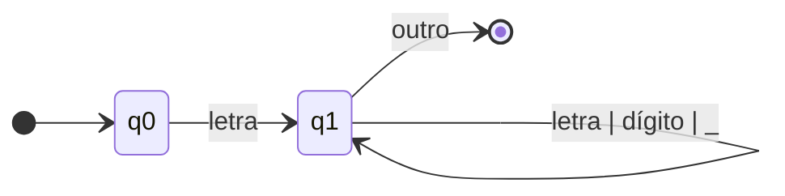
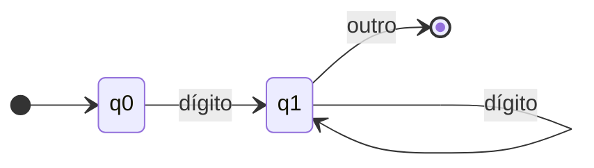
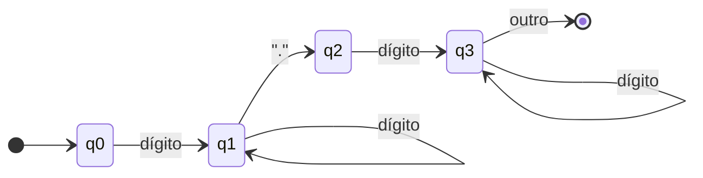
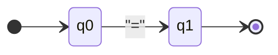
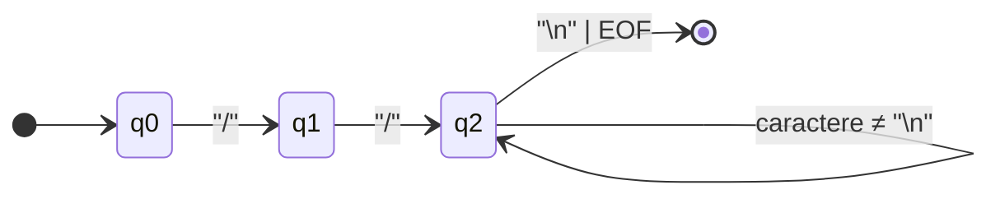
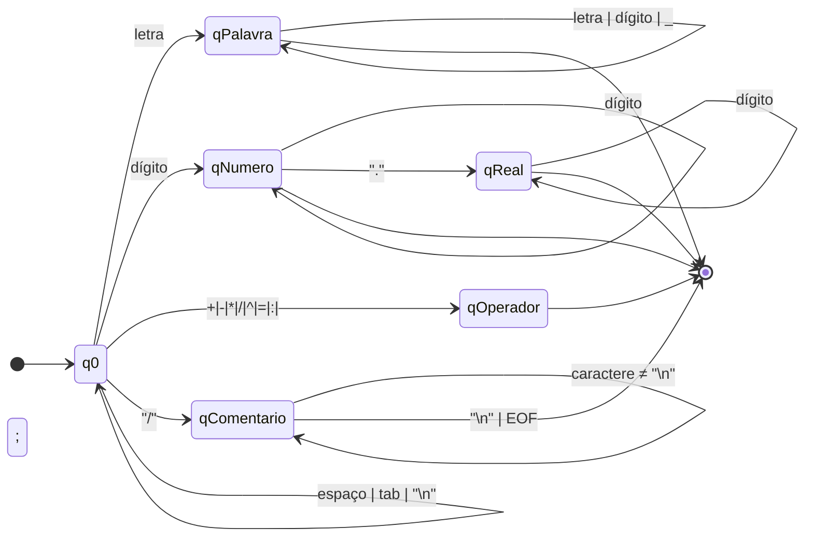

# Compilador PiLang

Documentação unificada do projeto acadêmico da linguagem PiLang. Este arquivo substitui os antigos `especificacao_pilang.md`, `automatos_tokens.md` e `gramatica_pilang.md`.

## Sumário

- [Visão Geral](#visão-geral)
- [Estrutura do Projeto](#estrutura-do-projeto)
- [Como Executar](#como-executar)
- [Linguagem PiLang](#linguagem-pilang)
  - [Estrutura do Programa](#estrutura-do-programa)
  - [Palavras Reservadas, Tipos e Operadores](#palavras-reservadas-tipos-e-operadores)
  - [Regras Léxicas e Semânticas](#regras-léxicas-e-semânticas)
- [Gramática Formal](#gramática-formal)
- [Autômatos Finitos Determinísticos](#autômatos-finitos-determinísticos)
- [Implementação do Compilador](#implementação-do-compilador)
  - [Análise Léxica](#análise-léxica)
  - [Análise Sintática (Recursiva)](#análise-sintática-recursiva)
  - [Análise SLR](#análise-slr)
  - [Interpretação](#interpretação)
  - [Tratamento de Erros](#tratamento-de-erros)
- [Exemplos de Programas](#exemplos-de-programas)
- [Extensões Futuras](#extensões-futuras)

## Visão Geral

PiLang é uma linguagem de programação educacional com palavras-chave em português brasileiro. O compilador inclui:

- **Análise léxica** baseada em autômatos finitos determinísticos (AFDs).
- **Análise sintática** com parser descendente recursivo e validação adicional por **análise SLR**.
- **Interpretação** imediata da AST resultante.
- **Interface interativa** para digitação incremental de programas.

## Estrutura do Projeto

```
compilador/
├── README.md                 # Documentação unificada (este arquivo)
├── tokens.py                 # Tipos de token e tabela de palavras reservadas
├── lexer.py                  # Analisador léxico baseado em AFDs
├── parser.py                 # Analisador sintático recursivo e AST
├── slr.py                    # Construção de tabelas SLR(1)
├── interpreter.py            # Interpretador da AST
├── interface_interativa.py   # Interface CLI interativa
├── testar_exemplos.py        # Execução em lote dos exemplos
├── test_lexer.py             # Testes do analisador léxico
├── test_parser.py            # Testes do analisador sintático
└── exemplos/
    ├── exemplo_simples.pi
    ├── exemplo_matematico.pi
    ├── exemplo_reais.pi
    ├── exemplo_sem_variaveis.pi
    └── exemplo_com_erros.pi
```

## Como Executar

- **Modo interativo:**
  ```bash
  python interface_interativa.py
  ```
- **Modo arquivo:**
  ```bash
  python interface_interativa.py exemplos/exemplo_simples.pi
  ```
- **Testes:**
  ```bash
  python test_lexer.py
  python test_parser.py
  python testar_exemplos.py
  ```

## Linguagem PiLang

### Estrutura do Programa

```
INICIO
    VARIAVEIS
        nome_variavel: TIPO;
        ...
    FIM_VARIAVEIS

    // Comandos do programa
FIM
```

### Palavras Reservadas, Tipos e Operadores

- **Palavras-chave:** `INICIO`, `FIM`, `VARIAVEIS`, `FIM_VARIAVEIS`, `INTEIRO`, `REAL`, `LEIA`, `ESCREVA`.
- **Tipos primitivos:** `INTEIRO` (inteiros) e `REAL` (ponto flutuante).
- **Operadores aritméticos:** `+`, `-`, `*`, `/`, `^`.
- **Operador de atribuição:** `=`.
- **Pontuação:** `:` (declaração de tipo) e `;` (término de comando).
- **Comentários:** iniciados com `//` até o fim da linha.

### Regras Léxicas e Semânticas

- Identificadores iniciam por letra, seguidos de letras, dígitos ou `_`; não podem ser palavras reservadas.
- Números inteiros: `0-9+`. Números reais: parte inteira, ponto decimal e parte fracionária.
- Espaços em branco são ignorados exceto como separadores de tokens.
- Variáveis devem ser declaradas antes do uso, não podem ser redeclaradas e precisam ser inicializadas antes de participar de expressões.

## Gramática Formal

Gramática LR(1) utilizada no parser recursivo e na construção SLR (em BNF):

```bnf
<programa> ::= INICIO <declaracao_variaveis> <comandos> FIM

<declaracao_variaveis> ::= VARIAVEIS <lista_declaracoes> FIM_VARIAVEIS
                         | ε

<lista_declaracoes> ::= <declaracao> <lista_declaracoes>
                      | <declaracao>

<declaracao> ::= IDENTIFICADOR : <tipo> ;

<tipo> ::= INTEIRO
         | REAL

<comandos> ::= <comando> <comandos>
             | <comando>

<comando> ::= <comando_leitura>
            | <comando_escrita>
            | <comando_atribuicao>

<comando_leitura> ::= LEIA IDENTIFICADOR ;

<comando_escrita> ::= ESCREVA IDENTIFICADOR ;

<comando_atribuicao> ::= IDENTIFICADOR = <expressao> ;

<expressao> ::= <expressao_simples>

<expressao_simples> ::= <termo>
                      | <expressao_simples> + <termo>
                      | <expressao_simples> - <termo>

<termo> ::= <fator>
          | <termo> * <fator>
          | <termo> / <fator>

<fator> ::= <elemento>
          | <fator> ^ <elemento>

<elemento> ::= IDENTIFICADOR
             | NUM_INTEIRO
             | NUM_REAL
             | ( <expressao> )
```

## Autômatos Finitos Determinísticos

Os AFDs a seguir representam o reconhecimento de tokens da linguagem. Diagramas modelados em Mermaid para consulta rápida.

### AFD 1 – Identificadores



### AFD 2 – Números Inteiros



### AFD 3 – Números Reais



### AFD 4 – Operadores Aritméticos

```mermaid
stateDiagram-v2
    direction LR
    [*] --> q0
    q0 --> q+: "+"
    q0 --> q-: "-"
    q0 --> q*: "*"
    q0 --> q/: "/"
    q0 --> q^: "^"
    q+, q-, q*, q/, q^ --> [*]
```

### AFD 5 – Operador de Atribuição



### AFD 6 – Pontuação

```mermaid
stateDiagram-v2
    direction LR
    [*] --> q0
    q0 --> q1: ":"
    q0 --> q2: ";"
    q1 --> [*]
    q2 --> [*]
```



### AFD 7 – Comentários



### AFD 8 – Autômato Mestre



## Implementação do Compilador

### Análise Léxica

`lexer.py` implementa uma máquina de estados baseada nos AFDs acima. Prioridades:

- Comentários são detectados primeiro e descartados.
- Palavras reservadas são diferenciadas de identificadores por comparação ao final do reconhecimento.
- Números reais têm precedência sobre inteiros quando um ponto decimal é identificado.

### Análise Sintática (Recursiva)

`parser.py` executa um parser descendente recursivo que constrói a AST com classes como `Programa`, `Declaracao`, `ComandoLeitura`, `ComandoEscrita`, `ComandoAtribuicao`, `ExpressaoSimples`, `Termo`, `Fator` e `Elemento`.

### Análise SLR

`slr.py` constrói conjuntos LR(0), tabelas `ACTION`/`GOTO` e executa a análise SLR para a gramática acima. O método `SLRAnalyzer.analisar()` retorna logs de pilha e entrada para depuração.

### Interpretação

`interpreter.py` percorre a AST e executa:

- Inicialização de variáveis declaradas.
- Comandos `LEIA` e `ESCREVA` com suporte a entrada simulada.
- Avaliação de expressões com precedência (`^`, `*`, `/`, `+`, `-`).

### Tratamento de Erros

- **Léxico:** reporta caracteres inválidos com linha e coluna.
- **Sintático:** lança `ErroSintatico` detalhando expectativa e posição.
- **Execução:** valida variáveis não declaradas, divisão por zero e operadores não suportados.

## Exemplos de Programas

### Exemplo Simples

```pi
INICIO
    VARIAVEIS
        a: INTEIRO;
        b: INTEIRO;
        resultado: INTEIRO;
    FIM_VARIAVEIS

    LEIA a;
    LEIA b;
    resultado = a + b;
    ESCREVA resultado;
FIM
```

### Exemplo Matemático

```pi
INICIO
    VARIAVEIS
        x: INTEIRO;
        y: INTEIRO;
        z: REAL;
    FIM_VARIAVEIS

    LEIA x;
    LEIA y;
    z = x + y * 2 ^ 3;
    ESCREVA z;
FIM
```

### Exemplo com Reais e Média

```pi
INICIO
    VARIAVEIS
        num1: REAL;
        num2: REAL;
        media: REAL;
    FIM_VARIAVEIS

    LEIA num1;
    LEIA num2;
    media = (num1 + num2) / 2;
    ESCREVA media;
FIM
```

## Extensões Futuras

- **Análise semântica** (tipagem e controle de fluxo).
- **Geração de código** para uma linguagem intermediária ou assembly.
- **Novos tipos** (strings, booleanos, arrays) e estruturas de controle (`SE`, `ENQUANTO`).
- **Funções/procedimentos** e suporte a módulos.
- **Recuperação de erros** mais robusta durante a análise sintática.

---

Projeto desenvolvido para fins educacionais no contexto de disciplinas de compiladores.
