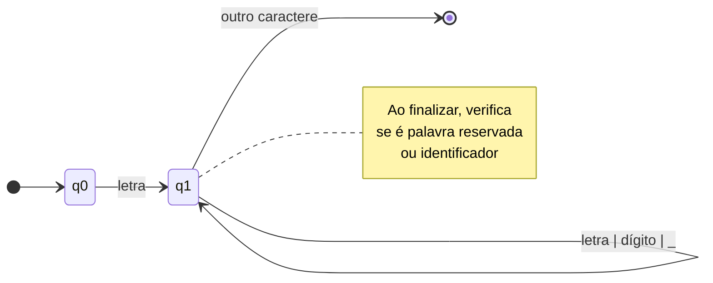
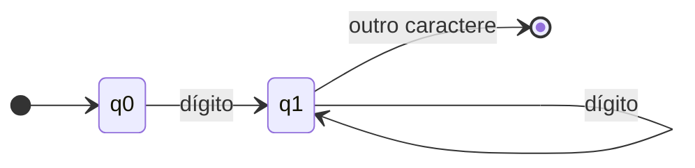
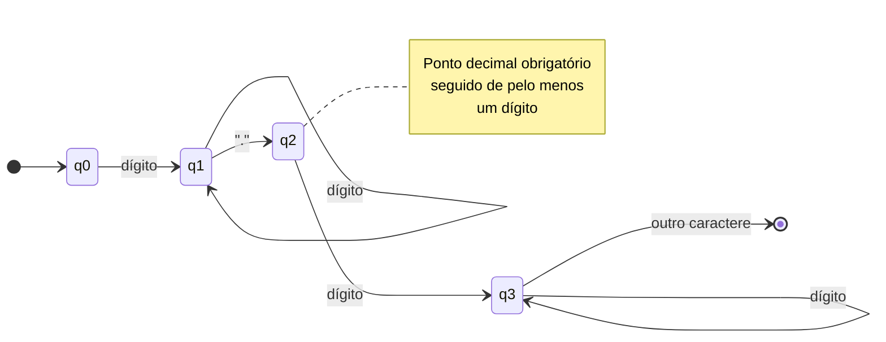
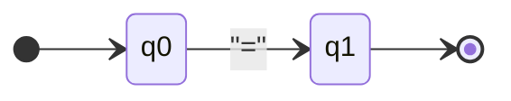
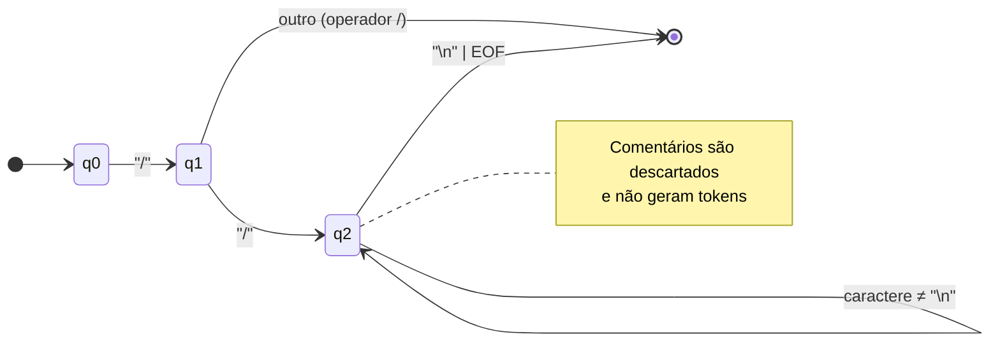

# DRAMATICA — Compilador de Linguagem de Programação Teatral

> **Resumo:** DRAMATICA é uma linguagem de programação inspirada em dramaturgia. Cada programa é uma peça; cada arquivo é uma cena; cada personagem é um ator. A sintaxe foi desenhada para ser expressiva, legível e naturalmente teatral — ideal para ensinar conceitos de compiladores de forma criativa e envolvente.

---

## Sumário

- [Visão Geral](#visão-geral)
- [Estrutura do Projeto](#estrutura-do-projeto)
- [Como Executar](#como-executar)
- [Linguagem DRAMATICA](#linguagem-dramatica)
  - [Estrutura do Programa](#estrutura-do-programa)
  - [Palavras Reservadas, Tipos e Operadores](#palavras-reservadas-tipos-e-operadores)
  - [Regras Léxicas e Semânticas](#regras-léxicas-e-semânticas)
- [Gramática Formal (EBNF)](#gramática-formal-ebnf)
- [Autômatos Finitos Determinísticos](#autômatos-finitos-determinísticos)
- [Implementação do Compilador](#implementação-do-compilador)
  - [Análise Léxica](#análise-léxica)
  - [Análise Sintática (Recursiva)](#análise-sintática-recursiva)
  - [Interpretação](#interpretação)
  - [Tratamento de Erros](#tratamento-de-erros)
- [Exemplos de Programas](#exemplos-de-programas)
- [Relatório das 4 Etapas](#relatório-das-4-etapas)

---

## Visão Geral

DRAMATICA é uma linguagem de programação educacional com sintaxe inspirada em teatro. O compilador inclui:

- **Análise léxica** baseada em autômatos finitos determinísticos (AFDs).
- **Análise sintática** com parser descendente recursivo.
- **Interpretação** imediata da AST resultante.
- **Interface web** para digitação incremental de programas em tempo real.

---

## Estrutura do Projeto

```
compilador/
├── README.md                 # Documentação completa (este arquivo)
├── RELATORIO_4_ETAPAS.md     # Relatório detalhado das 4 etapas
├── tokens.py                 # Tipos de token e tabela de palavras reservadas
├── lexer.py                  # Analisador léxico baseado em AFDs
├── parser.py                  # Analisador sintático recursivo e AST
├── interpreter.py             # Interpretador da AST
├── app.py                     # Interface web Flask
├── index.html                 # Interface web frontend
├── test_lexer.py             # Testes do analisador léxico
├── test_parser.py            # Testes do analisador sintático
└── exemplos/
    ├── exemplo_simples.dramatica
    ├── exemplo_matematico.dramatica
    ├── exemplo_subtracao.dramatica
    └── exemplo_sem_variaveis.dramatica
```

---

## Instalação e Configuração

### Pré-requisitos

- **Python 3.7 ou superior** (recomendado Python 3.9+)
- **pip** (gerenciador de pacotes Python)
- **Navegador web moderno** (Chrome, Firefox, Edge, Safari)

### Passo a Passo de Instalação

#### 1. Clone ou Baixe o Projeto

Se você tem o projeto em um repositório Git:

```bash
git clone <url-do-repositorio>
cd compilador
```

Ou simplesmente extraia o arquivo ZIP do projeto para uma pasta.

#### 2. Crie um Ambiente Virtual (Recomendado)

Criar um ambiente virtual isola as dependências do projeto:

**Windows:**
```bash
python -m venv venv
venv\Scripts\activate
```

**Linux/Mac:**
```bash
python3 -m venv venv
source venv/bin/activate
```

Após ativar o ambiente virtual, você verá `(venv)` no início da linha do terminal.

#### 3. Instale as Dependências

Com o ambiente virtual ativado, instale as dependências necessárias:

```bash
pip install -r requirements.txt
```

Isso instalará:
- **Flask** (framework web)
- **flask-cors** (permissão de requisições cross-origin)

#### 4. Verifique a Instalação

Teste se tudo está funcionando:

```bash
python -c "from lexer import Lexer; print('Lexer OK')"
python -c "from parser import Parser; print('Parser OK')"
python -c "from interpreter import InterpretadorPiLang; print('Interpreter OK')"
```

Se todos os comandos executarem sem erros, a instalação foi bem-sucedida!

---

## Como Executar

### Interface Web (Recomendado)

1. **Inicie o servidor Flask:**

```bash
python app.py
```

2. **Acesse no navegador:**

Abra seu navegador e acesse: `http://localhost:5000`

3. **Use a interface:**

- Digite ou cole código DRAMATICA no editor
- Clique em "Analisar" para verificar erros léxicos e sintáticos
- Clique em "Executar" para rodar o programa
- Use o dropdown "Carregar Exemplo" para testar programas pré-configurados

**Nota:** O servidor ficará rodando até você pressionar `Ctrl+C` no terminal.

### Modo CLI (Linha de Comando)

Para testar componentes individuais:

```bash
# Testa análise léxica
python test_lexer.py

# Testa análise sintática  
python test_parser.py
```

### Executar um Programa DRAMATICA

Você também pode executar programas diretamente via Python:

```python
from lexer import Lexer
from parser import Parser
from interpreter import InterpretadorPiLang

# Código DRAMATICA
codigo = """
CENA Teste:
    PERSONAGEM Calculadora:
        MEMORIA:
            a: INT;
            b: INT;
        FIM_MEMORIA
    LEIA a;
    LEIA b;
    Calculadora DIZ a;
FIM_CENA
"""

# Análise léxica
lexer = Lexer(codigo)
tokens, erros = lexer.tokenizar()

if erros:
    print("Erros léxicos:", erros)
else:
    # Análise sintática
    parser = Parser(tokens)
    ast = parser.parse()
    
    # Execução
    interpretador = InterpretadorPiLang()
    interpretador.definir_entrada([10, 20])  # Valores para LEIA
    interpretador.executar_programa(ast)
```

---

## Solução de Problemas

### Erro: "ModuleNotFoundError: No module named 'flask'"

**Solução:** Instale as dependências:
```bash
pip install -r requirements.txt
```

### Erro: "Address already in use" ao iniciar o servidor

**Solução:** Outro processo está usando a porta 5000. Pare o processo ou mude a porta em `app.py`:
```python
app.run(port=5001)  # Use outra porta
```

### Erro: "python: command not found"

**Solução:** 
- Windows: Use `py` ao invés de `python`
- Linux/Mac: Use `python3` ao invés de `python`

### Ambiente virtual não ativa

**Solução:**
- Windows: Certifique-se de usar `venv\Scripts\activate` (não `venv/Scripts/activate`)
- Linux/Mac: Certifique-se de usar `source venv/bin/activate`

---

## Linguagem DRAMATICA

### Estrutura do Programa

Cada programa em DRAMATICA representa uma **cena teatral**:

```
CENA NomeCena:
    PERSONAGEM NomePersonagem:
        MEMORIA:
            variavel1: INT;
            variavel2: INT;
        FIM_MEMORIA

    LEIA variavel1;
    variavel2 = variavel1 + 5;
    Personagem DIZ variavel2;
FIM_CENA
```

### Palavras Reservadas, Tipos e Operadores

#### Palavras-chave Teatrais

- `CENA` — Início do programa (marca o início da cena) - **case-sensitive, deve ser MAIÚSCULAS**
- `FIM_CENA` — Fim do programa (marca o fim da cena)
- `PERSONAGEM` — Declara um personagem/ator - **case-sensitive, deve ser MAIÚSCULAS**
- `MEMORIA:` — Bloco de declaração de variáveis do personagem - **case-sensitive, deve ser MAIÚSCULAS**
- `FIM_MEMORIA` — Fim do bloco de declarações

#### Comandos

- `LEIA` — Comando de leitura de variável
- `DIZ` — Comando de escrita teatral (ex: `Personagem DIZ valor;`) - **case-sensitive, deve ser MAIÚSCULAS**

#### Tipos (Padrão Banco de Dados)

- `VARCHAR` — Tipo string/texto (aceita qualquer valor, incluindo números como string)
- `INT` — Tipo inteiro (aceita apenas números inteiros, rejeita letras)
- `FLOAT` — Tipo real (aceita números inteiros ou decimais, rejeita letras)

#### Operadores Aritméticos

- `+` — Adição
- `-` — Subtração
- `*` — Multiplicação
- `/` — Divisão
- `^` — Potenciação

#### Operadores e Símbolos

- `=` — Operador de atribuição
- `:` — Separador de tipo (em declarações)
- `;` — Término de comando
- `(` `)` — Parênteses para agrupamento
- `//` — Início de comentário (até fim da linha)

### Regras Léxicas e Semânticas

- **Identificadores:** iniciam por letra, seguidos de letras, dígitos ou `_`; não podem ser palavras reservadas.
- **Números inteiros:** sequência de dígitos `0-9+`.
- **Números reais:** parte inteira, ponto decimal obrigatório e parte fracionária.
- **Espaços em branco:** ignorados exceto como separadores de tokens.
- **Comentários:** iniciados com `//` e continuam até o fim da linha.
- **Variáveis:** devem ser declaradas no bloco `MEMORIA:` antes do uso.
- **Case-sensitive:** O compilador é case-sensitive - todas as palavras reservadas devem ser em MAIÚSCULAS.
- **Validação de tipos:** Variáveis `INT` e `FLOAT` rejeitam letras no comando `LEIA`, enquanto `VARCHAR` aceita qualquer valor.

---

## Gramática Formal (EBNF)

Gramática completa da linguagem DRAMATICA em EBNF:

```ebnf
<programa> ::= "CENA" IDENTIFICADOR ":" <personagem> <comandos> "FIM_CENA"

<personagem> ::= "PERSONAGEM" IDENTIFICADOR ":" <declaracao_variaveis>

<declaracao_variaveis> ::= "MEMORIA" ":" <lista_declaracoes> "FIM_MEMORIA"
                         | ε

<lista_declaracoes> ::= <declaracao> <lista_declaracoes>
                      | <declaracao>

<declaracao> ::= IDENTIFICADOR ":" ("VARCHAR" | "INT" | "FLOAT") ";"

<comandos> ::= <comando> <comandos>
             | <comando>

<comando> ::= <comando_leitura>
            | <comando_escrita>
            | <comando_atribuicao>

<comando_leitura> ::= "LEIA" IDENTIFICADOR ";"

<comando_escrita> ::= IDENTIFICADOR "DIZ" <expressao> ";"

<comando_atribuicao> ::= IDENTIFICADOR "=" <expressao> ";"

<expressao> ::= <expressao_simples>

<expressao_simples> ::= <termo>
                      | <expressao_simples> "+" <termo>
                      | <expressao_simples> "-" <termo>

<termo> ::= <fator>
          | <termo> "*" <fator>
          | <termo> "/" <fator>

<fator> ::= <elemento>
          | <fator> "^" <elemento>

<elemento> ::= IDENTIFICADOR
             | NUM_INTEIRO
             | NUM_REAL
             | "(" <expressao> ")"
```

---

## Autômatos Finitos Determinísticos

Os AFDs a seguir representam o reconhecimento de tokens da linguagem DRAMATICA. Cada autômato é implementado no lexer como uma máquina de estados.

### AFD 1 – Identificadores e Palavras Reservadas



**Descrição:** Reconhece identificadores (nomes de variáveis, personagens, cenas) e palavras reservadas. Começa com letra e pode conter letras, dígitos e underscore.

### AFD 2 – Números Inteiros



**Descrição:** Reconhece números inteiros como sequência de um ou mais dígitos.

### AFD 3 – Números Reais



**Descrição:** Reconhece números reais com parte inteira, ponto decimal obrigatório e parte fracionária.

### AFD 4 – Operadores Aritméticos

```mermaid
stateDiagram-v2
    direction LR
    [*] --> q0
    q0 --> q+: "+"
    q0 --> q-: "-"
    q0 --> q*: "*"
    q0 --> q/: "/"
    q0 --> q^: "^"
    q+, q-, q*, q/, q^ --> [*]
```

**Descrição:** Reconhece operadores aritméticos: adição (+), subtração (-), multiplicação (*), divisão (/) e potenciação (^).

### AFD 5 – Operador de Atribuição



**Descrição:** Reconhece o operador de atribuição (=).

### AFD 6 – Símbolos de Pontuação

```mermaid
stateDiagram-v2
    direction LR
    [*] --> q0
    q0 --> q1: ":"
    q0 --> q2: ";"
    q0 --> q3: "("
    q0 --> q4: ")"
    q1, q2, q3, q4 --> [*]
```



**Descrição:** Reconhece dois pontos (:), ponto e vírgula (;), parêntese esquerdo (() e parêntese direito ()).

### AFD 7 – Comentários



**Descrição:** Reconhece comentários iniciados com `//` e continua até o fim da linha ou EOF.

### AFD 8 – Autômato Mestre (Estado Inicial)

```mermaid
stateDiagram-v2
    direction LR
    [*] --> q0
    q0 --> qPalavra: letra
    q0 --> qNumero: dígito
    q0 --> qOperador: +|-|*|/|^|=|:|;|(|)
    q0 --> qComentario: "/"
    q0 --> q0: espaço | tab | "\n"
    qPalavra --> qPalavra: letra | dígito | _
    qPalavra --> [*]
    qNumero --> qNumero: dígito
    qNumero --> qReal: "."
    qReal --> qReal: dígito
    qNumero --> [*]
    qReal --> [*]
    qOperador --> [*]
    qComentario --> qComentario: caractere ≠ "\n"
    qComentario --> [*]: "\n" | EOF
```



**Descrição:** Autômato mestre que coordena o reconhecimento de todos os tokens. O estado inicial `q0` decide qual caminho seguir baseado no primeiro caractere.

---

## Implementação do Compilador

### Análise Léxica

O arquivo `lexer.py` implementa uma máquina de estados baseada nos AFDs acima. Características principais:

- **Método `estado_q0()`:** Estado inicial que decide qual autômato usar.
- **Método `estado_palavra()`:** Reconhece identificadores e palavras reservadas.
- **Método `estado_numero()`:** Reconhece números inteiros e reais.
- **Método `estado_operador()`:** Reconhece operadores e símbolos.
- **Método `estado_comentario()`:** Descarta comentários.

**Prioridades de reconhecimento:**
1. Comentários são detectados primeiro e descartados.
2. Palavras reservadas são diferenciadas de identificadores por comparação ao final do reconhecimento.
3. Números reais têm precedência sobre inteiros quando um ponto decimal é identificado.

### Análise Sintática (Recursiva)

O arquivo `parser.py` implementa um parser descendente recursivo que constrói a AST (Abstract Syntax Tree). Estrutura da AST:

- **`Programa`:** Nó raiz contendo nome da cena, personagem e comandos.
- **`Personagem`:** Contém nome e declarações de variáveis.
- **`Declaracao`:** Representa declaração de variável com nome e tipo.
- **`ComandoLeitura`:** Comando `LEIA`.
- **`ComandoEscrita`:** Comando `Personagem diz expressao`.
- **`ComandoAtribuicao`:** Atribuição `variavel = expressao`.
- **`ExpressaoSimples`:** Expressões com operadores `+` e `-`.
- **`Termo`:** Termos com operadores `*` e `/`.
- **`Fator`:** Fatores com operador `^`.
- **`Elemento`:** Elementos atômicos (identificadores, números, expressões entre parênteses).

**Métodos principais:**
- `parser_programa()`: Inicia a análise sintática.
- `parser_personagem()`: Analisa declaração de personagem.
- `parser_declaracao_variaveis()`: Analisa bloco de declarações.
- `parser_comandos()`: Analisa lista de comandos.
- `parser_expressao()`: Analisa expressões aritméticas.

### Interpretação

O arquivo `interpreter.py` percorre a AST e executa o programa:

- **Inicialização:** Processa declarações de variáveis e inicializa com valor padrão (0).
- **Execução de comandos:**
  - `LEIA`: Lê valor da entrada simulada e atribui à variável.
  - `diz`: Avalia expressão e imprime o valor.
  - Atribuição: Avalia expressão e atribui à variável.
- **Avaliação de expressões:** Respeita precedência de operadores (`^` > `*`, `/` > `+`, `-`).

### Tratamento de Erros

#### Erros Léxicos

- **Caracteres inválidos:** Reportados com linha e coluna exatas.
- **Exemplo:** `Erro léxico na linha 5, coluna 10: caractere inválido '@'`

#### Erros Sintáticos

- **Tokens inesperados:** Lançam `ErroSintatico` com mensagem descritiva.
- **Exemplo:** `Erro sintático na linha 8, coluna 3: Esperado ';' após comando LEIA`

#### Erros de Execução

- **Variáveis não inicializadas:** Reportados durante avaliação de expressões.
- **Divisão por zero:** Detectada e reportada.

---

## Exemplos de Programas

### Exemplo 1: Soma Simples

```dramatica
CENA Soma:
    PERSONAGEM Calculadora:
        MEMORIA:
            a: INT;
            b: INT;
            resultado: INT;
        FIM_MEMORIA

    LEIA a;
    LEIA b;
    resultado = a + b;
    Calculadora DIZ resultado;
FIM_CENA
```

**Saída esperada:**
```
=== EXECUÇÃO DA CENA: Soma ===
Personagem: Calculadora
Declarada: a: INT
Declarada: b: INT
Declarada: resultado: INT
LEIA a -> 10
LEIA b -> 20
resultado = 30
Calculadora diz: 30
```

### Exemplo 2: Operação de Subtração

```dramatica
CENA Subtracao:
    PERSONAGEM Operador:
        MEMORIA:
            num1: INT;
            num2: INT;
            diferenca: INT;
        FIM_MEMORIA

    LEIA num1;
    LEIA num2;
    diferenca = num1 - num2;
    Operador DIZ diferenca;
FIM_CENA
```

### Exemplo 3: Expressão Matemática Complexa

```dramatica
CENA Matematica:
    PERSONAGEM Matematico:
        MEMORIA:
            x: FLOAT;
            y: FLOAT;
            z: FLOAT;
        FIM_MEMORIA

    LEIA x;
    LEIA y;
    z = x + y * 2;
    Matematico DIZ z;
FIM_CENA
```

### Exemplo 4: Programa Mínimo (Sem Variáveis)

```dramatica
CENA Minimo:
    PERSONAGEM Ator:
        MEMORIA:
        FIM_MEMORIA

    LEIA a;
    Ator DIZ a;
FIM_CENA
```

### Exemplo 5: Validação de Tipos

Este exemplo demonstra como os tipos VARCHAR, INT e FLOAT funcionam com validação rigorosa:

```dramatica
CENA ValidacaoTipos:
    PERSONAGEM Validador:
        MEMORIA:
            nome: VARCHAR;
            idade: INT;
            altura: FLOAT;
        FIM_MEMORIA

    LEIA nome;    // VARCHAR aceita qualquer valor
    LEIA idade;   // INT aceita apenas números inteiros
    LEIA altura;  // FLOAT aceita números (inteiros ou decimais)
    
    Validador DIZ nome;
    Validador DIZ idade;
    Validador DIZ altura;
FIM_CENA
```

**Comportamento:**
- **VARCHAR:** Aceita `"João"`, `"123"`, `"abc"` - qualquer valor é aceito como string
- **INT:** Aceita `25`, `100` - rejeita `"abc"` ou `"25.5"` (gera erro)
- **FLOAT:** Aceita `1.75`, `100` - rejeita `"xyz"` (gera erro)

### Exemplo 6: VARCHAR Aceita Números

Demonstra que VARCHAR pode receber números, mas eles são tratados como texto:

```dramatica
CENA VarcharNumero:
    PERSONAGEM Processador:
        MEMORIA:
            codigo: VARCHAR;
            numero: VARCHAR;
        FIM_MEMORIA

    LEIA codigo;   // Pode receber "ABC123" ou "123"
    LEIA numero;   // Pode receber "42" (número como string)
    
    Processador DIZ codigo;
    Processador DIZ numero;
FIM_CENA
```

**Entrada válida:**
- `codigo: "ABC123"` ou `codigo: "123"`
- `numero: "42"` ou `numero: "abc"`

Ambos são aceitos porque VARCHAR aceita qualquer valor.

---

## Relatório das 4 Etapas

Para documentação detalhada de cada etapa do projeto, consulte o arquivo **[RELATORIO_4_ETAPAS.md](RELATORIO_4_ETAPAS.md)** que contém:

1. **ETAPA 1:** Criação da Linguagem de Programação DRAMATICA
2. **ETAPA 2:** Construção dos Autômatos de Reconhecimento de Tokens
3. **ETAPA 3:** Implementação do Analisador Léxico
4. **ETAPA 4:** Implementação do Analisador Sintático

---

## Requisitos Acadêmicos Atendidos

✅ **Palavras-chave para início e fim:** `CENA` e `FIM_CENA` (case-sensitive)  
✅ **Cabeçalho para declaração de variáveis:** `MEMORIA:` dentro de `PERSONAGEM` (case-sensitive)  
✅ **Tipos de dados:** `VARCHAR`, `INT`, `FLOAT` (padrão banco de dados, com validação rigorosa)  
✅ **Comandos de escrita e leitura:** `LEIA` e `Personagem DIZ` (case-sensitive)  
✅ **Validação de tipos:** `INT` e `FLOAT` rejeitam letras, `VARCHAR` aceita qualquer valor  
✅ **Operações de adição e subtração:** `+` e `-` (também `*`, `/`, `^`)  
✅ **Atribuição:** `=` com um ou dois operandos  
✅ **Símbolo de pontuação:** `;` ao final de cada comando  
✅ **Análise léxica:** Implementada com autômatos finitos determinísticos  
✅ **Análise sintática:** Parser descendente recursivo  
✅ **Tratamento de erros:** Erros léxicos e sintáticos reportados adequadamente  
✅ **Funcionamento em tempo real:** Interface web para entrada incremental  

---

**Projeto desenvolvido para fins educacionais no contexto de disciplinas de compiladores.**
