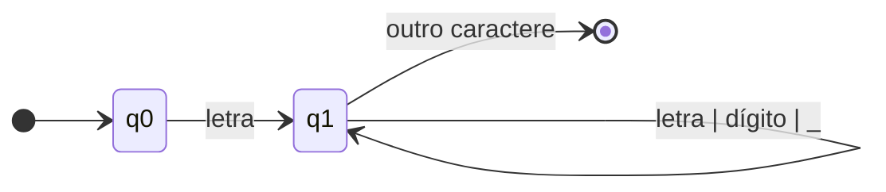
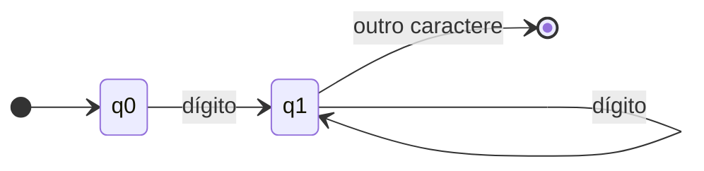
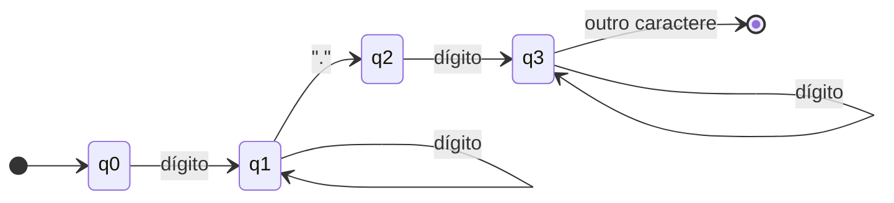
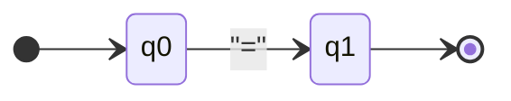
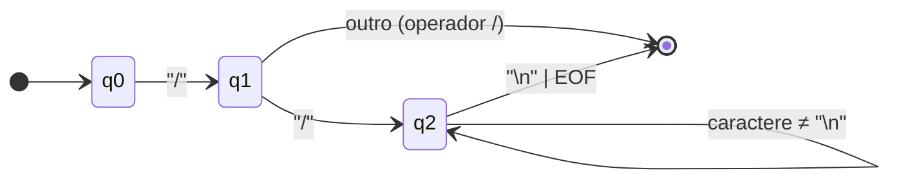

# Relatório das 4 Etapas — Projeto DRAMATICA

> **Projeto:** Compilador da Linguagem de Programação DRAMATICA  
> **Disciplina:** Compiladores  
> **Objetivo:** Criar uma linguagem de programação simplificada do zero, aplicando conceitos fundamentais de compiladores

---

## Sumário

1. [ETAPA 1: Criação da Linguagem de Programação](#etapa-1-criação-da-linguagem-de-programação)
2. [ETAPA 2: Construção dos Autômatos de Reconhecimento de Tokens](#etapa-2-construção-dos-autômatos-de-reconhecimento-de-tokens)
3. [ETAPA 3: Implementação do Analisador Léxico](#etapa-3-implementação-do-analisador-léxico)
4. [ETAPA 4: Implementação do Analisador Sintático](#etapa-4-implementação-do-analisador-sintático)

---

## ETAPA 1: Criação da Linguagem de Programação

### 1.1 Proposta e Conceito

A linguagem **DRAMATICA** foi criada com inspiração em dramaturgia e teatro. Cada programa representa uma **cena teatral**, onde:

- **`CENA`** marca o início do programa (case-sensitive, deve ser MAIÚSCULAS)
- **`FIM_CENA`** marca o fim do programa
- **`PERSONAGEM`** declara um personagem/ator (case-sensitive, deve ser MAIÚSCULAS)
- **`MEMORIA:`** é o cabeçalho para declaração de variáveis (case-sensitive, deve ser MAIÚSCULAS)
- **`FIM_MEMORIA`** marca o fim das declarações
- **`DIZ`** é o comando de escrita (case-sensitive, deve ser MAIÚSCULAS)
- **`LEIA`** é o comando de leitura

### 1.2 Estrutura da Linguagem

#### Palavras-chave para início e fim do programa

- **Início:** `CENA NomeCena:` (case-sensitive)
- **Fim:** `FIM_CENA`

#### Cabeçalho para declaração de variáveis

```
PERSONAGEM NomePersonagem:
    MEMORIA:
        variavel1: INT;
        variavel2: FLOAT;
        nome: VARCHAR;
    FIM_MEMORIA
```

#### Tipos de dados (Padrão Banco de Dados)

- **`VARCHAR`:** Tipo string/texto - aceita qualquer valor (incluindo números como string)
- **`INT`:** Tipo inteiro - aceita apenas números inteiros, rejeita letras
- **`FLOAT`:** Tipo real - aceita números (inteiros ou decimais), rejeita letras

#### Comandos de escrita e leitura

- **Leitura:** `LEIA variavel;` (com validação de tipos)
- **Escrita:** `Personagem DIZ expressao;` (case-sensitive)

#### Operações aritméticas

- **Adição:** `+`
- **Subtração:** `-`
- **Multiplicação:** `*` (extensão)
- **Divisão:** `/` (extensão)
- **Potenciação:** `^` (extensão)

#### Atribuição

- **Formato:** `variavel = expressao;`
- **Suporta:** Um ou dois operandos (ex: `a = b;` ou `a = b + c;`)

#### Símbolo de pontuação

- **`;`** ao final de cada comando (obrigatório)

### 1.3 Exemplo Completo

```dramatica
CENA Soma:
    PERSONAGEM Calculadora:
        MEMORIA:
            a: INT;
            b: INT;
            resultado: INT;
        FIM_MEMORIA

    LEIA a;
    LEIA b;
    resultado = a + b;
    Calculadora DIZ resultado;
FIM_CENA
```

### 1.4 Criatividade e Originalidade

A linguagem DRAMATICA se destaca por:

- **Sintaxe teatral:** Programas parecem roteiros de peças
- **Metáfora clara:** Cenas, personagens e falas facilitam compreensão
- **Originalidade:** Abordagem única no contexto de linguagens educacionais
- **Legibilidade:** Código é naturalmente expressivo e narrativo

---

## ETAPA 2: Construção dos Autômatos de Reconhecimento de Tokens

### 2.1 Metodologia

Para cada tipo de token da linguagem DRAMATICA, foi projetado um **Autômato Finito Determinístico (AFD)** que reconhece o padrão correspondente. Os autômatos foram desenhados seguindo os princípios de:

- **Determinismo:** Cada estado tem transições bem definidas
- **Completude:** Todos os casos válidos são cobertos
- **Clareza:** Estados e transições são facilmente compreensíveis

### 2.2 Autômatos Projetados

#### AFD 1: Identificadores e Palavras Reservadas

**Descrição:** Reconhece nomes de variáveis, personagens, cenas e palavras reservadas.

**Diagrama:**


**Estados:**
- `q0`: Estado inicial
- `q1`: Estado de reconhecimento (aceita letras, dígitos e underscore)

**Transições:**
- `q0 → q1`: Ao encontrar uma letra
- `q1 → q1`: Continua enquanto encontrar letra, dígito ou underscore
- `q1 → [*]`: Ao encontrar outro caractere, finaliza reconhecimento

**Classificação:** Após reconhecimento, verifica se é palavra reservada ou identificador.

#### AFD 2: Números Inteiros

**Descrição:** Reconhece sequências de dígitos representando números inteiros.

**Diagrama:**


**Estados:**
- `q0`: Estado inicial
- `q1`: Estado de reconhecimento (aceita dígitos)

**Transições:**
- `q0 → q1`: Ao encontrar um dígito
- `q1 → q1`: Continua enquanto encontrar dígitos
- `q1 → [*]`: Ao encontrar outro caractere, finaliza

#### AFD 3: Números Reais

**Descrição:** Reconhece números com parte decimal.

**Diagrama:**


**Estados:**
- `q0`: Estado inicial
- `q1`: Parte inteira
- `q2`: Ponto decimal encontrado
- `q3`: Parte fracionária

**Transições:**
- `q0 → q1`: Ao encontrar dígito (início da parte inteira)
- `q1 → q1`: Continua parte inteira
- `q1 → q2`: Ao encontrar ponto decimal
- `q2 → q3`: Ao encontrar dígito após ponto
- `q3 → q3`: Continua parte fracionária
- `q3 → [*]`: Finaliza reconhecimento

**Observação:** O ponto decimal é obrigatório e deve ser seguido por pelo menos um dígito.

#### AFD 4: Operadores Aritméticos

**Descrição:** Reconhece operadores `+`, `-`, `*`, `/`, `^`.

**Diagrama:**
```mermaid
stateDiagram-v2
    direction LR
    [*] --> q0
    q0 --> q+: "+"
    q0 --> q-: "-"
    q0 --> q*: "*"
    q0 --> q/: "/"
    q0 --> q^: "^"
    q+, q-, q*, q/, q^ --> [*]
```

**Estados:**
- `q0`: Estado inicial
- `q+`, `q-`, `q*`, `q/`, `q^`: Estados finais para cada operador

**Transições:** Cada operador é reconhecido em uma única transição.

#### AFD 5: Operador de Atribuição

**Descrição:** Reconhece o símbolo `=`.

**Diagrama:**


**Estados:**
- `q0`: Estado inicial
- `q1`: Estado final

#### AFD 6: Símbolos de Pontuação

**Descrição:** Reconhece `:`, `;`, `(`, `)`.

**Diagrama:**


```mermaid
stateDiagram-v2
    direction LR
    [*] --> q0
    q0 --> q1: ":"
    q0 --> q2: ";"
    q0 --> q3: "("
    q0 --> q4: ")"
    q1, q2, q3, q4 --> [*]
```

#### AFD 7: Comentários

**Descrição:** Reconhece e descarta comentários iniciados com `//`.

**Diagrama:**


**Estados:**
- `q0`: Estado inicial
- `q1`: Primeiro `/` encontrado
- `q2`: Segundo `/` encontrado (início do comentário)

**Comportamento:** Comentários são descartados e não geram tokens.

#### AFD 8: Autômato Mestre

**Descrição:** Coordena o reconhecimento de todos os tokens a partir do estado inicial.

**Diagrama:** Ver seção de Autômatos no README.md

**Função:** O estado inicial `q0` analisa o primeiro caractere e decide qual autômato específico usar.

### 2.3 Classificação de Tokens

Após o reconhecimento por um AFD, cada token é classificado em uma das seguintes categorias:

| Categoria | Exemplos |
|-----------|----------|
| Palavras Reservadas | `CENA`, `PERSONAGEM`, `MEMORIA`, `FIM_CENA`, `FIM_MEMORIA`, `LEIA`, `DIZ`, `VARCHAR`, `INT`, `FLOAT` |
| Identificadores | `Calculadora`, `a`, `resultado`, `variavel1` |
| Números Inteiros | `42`, `100`, `0` |
| Números Reais | `3.14`, `2.5`, `0.0` |
| Operadores | `+`, `-`, `*`, `/`, `^`, `=` |
| Pontuação | `:`, `;`, `(`, `)` |
| EOF | Fim de arquivo |

---

## ETAPA 3: Implementação do Analisador Léxico

### 3.1 Estrutura do Lexer

O analisador léxico (`lexer.py`) implementa uma **máquina de estados** baseada nos AFDs projetados na Etapa 2. A implementação segue fielmente a lógica dos autômatos, sem usar expressões regulares prontas.

### 3.2 Classe Lexer

```python
class Lexer:
    def __init__(self, codigo_fonte):
        self.codigo_fonte = codigo_fonte
        self.posicao = 0
        self.linha = 1
        self.coluna = 1
```

**Atributos:**
- `codigo_fonte`: Código fonte completo
- `posicao`: Posição atual no código
- `linha`: Linha atual (para relatório de erros)
- `coluna`: Coluna atual (para relatório de erros)

### 3.3 Métodos de Reconhecimento (Implementação dos AFDs)

#### `estado_q0()` — Estado Inicial

```python
def estado_q0(self):
    """Estado inicial do autômato - decide qual caminho seguir"""
    self.pular_espaco_branco()
    
    char = self.proximo_caractere()
    
    if char == '\0':
        return Token(TipoToken.EOF, '', self.linha, self.coluna)
    elif char == '/':
        return self.estado_comentario()
    elif char.isalpha():
        return self.estado_palavra()
    elif char.isdigit():
        return self.estado_numero()
    elif char in '+-*/^=:;()':
        return self.estado_operador()
    else:
        return Token(TipoToken.ERRO, char, self.linha, self.coluna)
```

**Função:** Implementa o AFD Mestre, decidindo qual autômato específico usar.

#### `estado_palavra()` — AFD 1

```python
def estado_palavra(self):
    """Estado para reconhecimento de palavras reservadas e identificadores"""
    linha_inicial = self.linha
    coluna_inicial = self.coluna
    lexema = ''
    
    while (self.proximo_caractere().isalnum() or 
           self.proximo_caractere() == '_'):
        lexema += self.proximo_caractere()
        self.avancar()
    
    if lexema in PALAVRAS_RESERVADAS:
        return Token(PALAVRAS_RESERVADAS[lexema], lexema, linha_inicial, coluna_inicial)
    else:
        return Token(TipoToken.IDENTIFICADOR, lexema, linha_inicial, coluna_inicial)
```

**Função:** Implementa o AFD 1, reconhecendo identificadores e palavras reservadas.

#### `estado_numero()` — AFD 2 e 3

```python
def estado_numero(self):
    """Estado para reconhecimento de números inteiros e reais"""
    linha_inicial = self.linha
    coluna_inicial = self.coluna
    lexema = ''
    tem_ponto = False
    
    while self.proximo_caractere().isdigit():
        lexema += self.proximo_caractere()
        self.avancar()
    
    if self.proximo_caractere() == '.':
        self.avancar()
        if self.proximo_caractere().isdigit():
            tem_ponto = True
            lexema += '.'
            while self.proximo_caractere().isdigit():
                lexema += self.proximo_caractere()
                self.avancar()
    
    if tem_ponto:
        return Token(TipoToken.NUM_REAL, lexema, linha_inicial, coluna_inicial)
    else:
        return Token(TipoToken.NUM_INTEIRO, lexema, linha_inicial, coluna_inicial)
```

**Função:** Implementa os AFDs 2 e 3, distinguindo entre números inteiros e reais.

#### `estado_operador()` — AFDs 4, 5 e 6

```python
def estado_operador(self):
    """Estado para reconhecimento de operadores e símbolos de pontuação"""
    char = self.proximo_caractere()
    linha_inicial = self.linha
    coluna_inicial = self.coluna
    
    self.avancar()
    
    if char == '+':
        return Token(TipoToken.OP_ADICAO, '+', linha_inicial, coluna_inicial)
    elif char == '-':
        return Token(TipoToken.OP_SUBTRACAO, '-', linha_inicial, coluna_inicial)
    # ... outros operadores
    elif char == '=':
        return Token(TipoToken.OP_ATRIBUICAO, '=', linha_inicial, coluna_inicial)
    # ... símbolos de pontuação
```

**Função:** Implementa os AFDs 4, 5 e 6, reconhecendo operadores e símbolos.

#### `estado_comentario()` — AFD 7

```python
def estado_comentario(self):
    """Estado para reconhecimento de comentários //"""
    linha_inicial = self.linha
    coluna_inicial = self.coluna
    
    self.avancar()  # Consome o primeiro '/'
    
    if self.proximo_caractere() == '/':
        self.avancar()  # Consome o segundo '/'
        while self.proximo_caractere() != '\n' and self.proximo_caractere() != '\0':
            self.avancar()
        return self.estado_q0()  # Retorna ao estado inicial
    else:
        return Token(TipoToken.OP_DIVISAO, '/', linha_inicial, coluna_inicial)
```

**Função:** Implementa o AFD 7, descartando comentários.

### 3.4 Método Principal: `tokenizar()`

```python
def tokenizar(self):
    """Tokeniza todo o código fonte e retorna uma lista de tokens e uma lista de erros."""
    tokens = []
    erros = []
    token = self.proximo_token()
    
    while token.tipo != TipoToken.EOF:
        if token.tipo == TipoToken.ERRO:
            erros.append(f"Erro léxico na linha {token.linha}, coluna {token.coluna}: caractere inválido '{token.lexema}'")
        else:
            tokens.append(token)
        
        token = self.proximo_token()
    
    tokens.append(token)  # Adiciona o token EOF
    return tokens, erros
```

**Função:** Processa todo o código fonte, gerando lista de tokens e lista de erros léxicos.

### 3.5 Fidelidade aos Autômatos

A implementação **não usa expressões regulares** para reconhecimento de tokens. Cada método de estado implementa diretamente a lógica do AFD correspondente:

- ✅ Estados são representados por métodos (`estado_q0`, `estado_palavra`, etc.)
- ✅ Transições são implementadas com condicionais (`if`, `elif`)
- ✅ Mudanças de estado são feitas através de chamadas de métodos
- ✅ Reconhecimento segue exatamente os diagramas dos AFDs

### 3.6 Tratamento de Erros Léxicos

Erros léxicos são detectados quando:
- Um caractere não corresponde a nenhum padrão reconhecido
- Um número real tem ponto sem dígitos após

**Exemplo de erro:**
```
Erro léxico na linha 5, coluna 10: caractere inválido '@'
```

### 3.7 Testes

O arquivo `test_lexer.py` contém testes que verificam:
- Reconhecimento correto de todos os tipos de tokens
- Tratamento adequado de erros léxicos
- Comentários são descartados corretamente

---

## ETAPA 4: Implementação do Analisador Sintático

### 4.1 Gramática Formal

A gramática da linguagem DRAMATICA foi definida em EBNF (Extended Backus-Naur Form):

```ebnf
<programa> ::= "CENA" IDENTIFICADOR ":" <personagem> <comandos> "FIM_CENA"

<personagem> ::= "PERSONAGEM" IDENTIFICADOR ":" <declaracao_variaveis>

<declaracao_variaveis> ::= "MEMORIA" ":" <lista_declaracoes> "FIM_MEMORIA"
                         | ε

<lista_declaracoes> ::= <declaracao> <lista_declaracoes>
                      | <declaracao>

<declaracao> ::= IDENTIFICADOR ":" ("VARCHAR" | "INT" | "FLOAT") ";"

<comandos> ::= <comando> <comandos>
             | <comando>

<comando> ::= <comando_leitura>
            | <comando_escrita>
            | <comando_atribuicao>

<comando_leitura> ::= "LEIA" IDENTIFICADOR ";"

<comando_escrita> ::= IDENTIFICADOR "says" <expressao> ";"

<comando_atribuicao> ::= IDENTIFICADOR "=" <expressao> ";"

<expressao> ::= <expressao_simples>

<expressao_simples> ::= <termo>
                      | <expressao_simples> "+" <termo>
                      | <expressao_simples> "-" <termo>

<termo> ::= <fator>
          | <termo> "*" <fator>
          | <termo> "/" <fator>

<fator> ::= <elemento>
          | <fator> "^" <elemento>

<elemento> ::= IDENTIFICADOR
             | NUM_INTEIRO
             | NUM_REAL
             | "(" <expressao> ")"
```

### 4.2 Método de Análise: Parser Descendente Recursivo

O analisador sintático (`parser.py`) implementa o método **descendente recursivo**, onde:

- Cada regra da gramática corresponde a um método
- A análise começa pelo símbolo inicial (`<programa>`)
- Métodos recursivos processam estruturas aninhadas
- Lookahead é usado para decidir qual produção aplicar

### 4.3 Estrutura da AST (Abstract Syntax Tree)

A AST é construída durante a análise sintática usando classes Python:

```python
class Programa:
    def __init__(self, nome_cena: str, personagem: 'Personagem', comandos: List['Comando']):
        self.nome_cena = nome_cena
        self.personagem = personagem
        self.comandos = comandos

class Personagem:
    def __init__(self, nome: str, declaracoes: List['Declaracao']):
        self.nome = nome
        self.declaracoes = declaracoes

class Declaracao:
    def __init__(self, nome: str, tipo: str):
        self.nome = nome
        self.tipo = tipo

class ComandoLeitura(Comando):
    def __init__(self, variavel: str):
        self.variavel = variavel

class ComandoEscrita(Comando):
    def __init__(self, personagem: str, expressao: 'Expressao'):
        self.personagem = personagem
        self.expressao = expressao

class ComandoAtribuicao(Comando):
    def __init__(self, variavel: str, expressao: 'Expressao'):
        self.variavel = variavel
        self.expressao = expressao
```

### 4.4 Métodos Principais do Parser

#### `parser_programa()` — Símbolo Inicial

```python
def parser_programa(self) -> Programa:
    """<programa> ::= scene IDENTIFICADOR : <personagem> <comandos> FIM_CENA"""
    self.consumir(TipoToken.SCENE, "Esperado 'scene' no início do programa")
    
    nome_cena_token = self.consumir(TipoToken.IDENTIFICADOR, "Esperado nome da cena")
    nome_cena = nome_cena_token.lexema
    
    self.consumir(TipoToken.DOIS_PONTOS, "Esperado ':' após nome da cena")
    
    personagem = self.parser_personagem()
    comandos = self.parser_comandos()
    
    self.consumir(TipoToken.FIM_CENA, "Esperado 'FIM_CENA' no final do programa")
    
    return Programa(nome_cena, personagem, comandos)
```

**Função:** Inicia a análise sintática e constrói o nó raiz da AST.

#### `parser_personagem()`

```python
def parser_personagem(self) -> Personagem:
    """<personagem> ::= character IDENTIFICADOR : <declaracao_variaveis>"""
    self.consumir(TipoToken.CHARACTER, "Esperado 'character'")
    
    nome_token = self.consumir(TipoToken.IDENTIFICADOR, "Esperado nome do personagem")
    nome = nome_token.lexema
    
    self.consumir(TipoToken.DOIS_PONTOS, "Esperado ':' após nome do personagem")
    
    declaracoes = self.parser_declaracao_variaveis()
    
    return Personagem(nome, declaracoes)
```

#### `parser_declaracao_variaveis()`

```python
def parser_declaracao_variaveis(self) -> List[Declaracao]:
    """<declaracao_variaveis> ::= memory : <lista_declaracoes> FIM_MEMORY | ε"""
    declaracoes = []
    
    if not self.verificar(TipoToken.MEMORY):
        return declaracoes  # Declarações são opcionais
    
    self.consumir(TipoToken.MEMORY, "Esperado 'memory'")
    self.consumir(TipoToken.DOIS_PONTOS, "Esperado ':' após 'memory'")
    
    declaracoes = self.parser_lista_declaracoes()
    
    self.consumir(TipoToken.FIM_MEMORY, "Esperado 'FIM_MEMORY' após declarações")
    
    return declaracoes
```

**Observação:** A produção `ε` (epsilon) é tratada verificando se o token `MEMORY` está presente.

#### `parser_comandos()` — Recursão

```python
def parser_comandos(self) -> List[Comando]:
    """<comandos> ::= <comando> <comandos> | <comando>"""
    comandos = []
    
    while (not self.verificar(TipoToken.EOF) and
           not self.verificar(TipoToken.FIM_CENA) and
           (self.verificar(TipoToken.LEIA) or 
            self.verificar(TipoToken.SAYS) or 
            self.verificar(TipoToken.IDENTIFICADOR))):
        
        comando = self.parser_comando()
        comandos.append(comando)
    
    return comandos
```

**Função:** Implementa recursão iterativa (loop) para processar múltiplos comandos.

#### `parser_expressao()` — Precedência de Operadores

A análise de expressões respeita a precedência de operadores:

1. **Parênteses** (maior precedência)
2. **Potenciação** (`^`)
3. **Multiplicação e Divisão** (`*`, `/`)
4. **Adição e Subtração** (`+`, `-`) (menor precedência)

```python
def parser_expressao_simples(self) -> ExpressaoSimples:
    """<expressao_simples> ::= <termo> <resto_expressao_simples>"""
    termos = []
    
    primeiro_termo = self.parser_termo()
    termos.append(("", primeiro_termo))
    
    while self.verificar(TipoToken.OP_ADICAO) or self.verificar(TipoToken.OP_SUBTRACAO):
        operador = self.token_atual.lexema
        self.avancar()
        termo = self.parser_termo()
        termos.append((operador, termo))
    
    return ExpressaoSimples(termos)
```

**Estratégia:** Cada nível de precedência é processado em um método separado, garantindo que operadores de maior precedência sejam processados primeiro.

### 4.5 Tratamento de Erros Sintáticos

#### Classe `ErroSintatico`

```python
class ErroSintatico(Exception):
    def __init__(self, mensagem: str, linha: int, coluna: int):
        self.mensagem = mensagem
        self.linha = linha
        self.coluna = coluna
        super().__init__(f"Erro sintático na linha {linha}, coluna {coluna}: {mensagem}")
```

#### Método `consumir()`

```python
def consumir(self, tipo_esperado: TipoToken, mensagem_erro: str) -> Token:
    """Consome o token atual se for do tipo esperado, caso contrário lança erro"""
    if self.verificar(tipo_esperado):
        token = self.token_atual
        self.avancar()
        return token
    else:
        raise ErroSintatico(
            mensagem_erro, 
            self.token_atual.linha, 
            self.token_atual.coluna
        )
```

**Função:** Garante que o token esperado está presente, lançando erro descritivo caso contrário.

### 4.6 Exemplos de Erros Sintáticos Detectados

#### Erro 1: Falta de `FIM_CENA`

```
Erro sintático na linha 15, coluna 1: Esperado 'FIM_CENA' no final do programa
```

#### Erro 2: Falta de ponto e vírgula

```
Erro sintático na linha 8, coluna 15: Esperado ';' após comando LEIA
```

#### Erro 3: Expressão incompleta

```
Erro sintático na linha 10, coluna 12: Esperado identificador, número ou expressão entre parênteses
```

### 4.7 Validação da Gramática

A gramática foi validada através de:

1. **Análise de exemplos válidos:** Todos os exemplos fornecidos são aceitos
2. **Teste de erros:** Erros sintáticos são detectados corretamente
3. **Derivação passo a passo:** Verificação manual de derivações para programas simples

### 4.8 Estrutura Modular

O parser foi desenvolvido de forma modular:

- ✅ Cada regra gramatical tem seu método correspondente
- ✅ Métodos são reutilizáveis e bem documentados
- ✅ Separação clara entre análise e construção da AST
- ✅ Fácil manutenção e expansão

### 4.9 Testes

O arquivo `test_parser.py` contém testes que verificam:

- Programas válidos são aceitos corretamente
- Erros sintáticos são detectados e reportados
- AST é construída corretamente
- Precedência de operadores é respeitada

---

## Conclusão

O projeto DRAMATICA foi desenvolvido com sucesso através das 4 etapas:

1. ✅ **Linguagem criada** com sintaxe teatral original e criativa
2. ✅ **Autômatos projetados** e documentados visualmente
3. ✅ **Analisador léxico implementado** fielmente aos autômatos
4. ✅ **Analisador sintático implementado** com parser descendente recursivo

Todos os requisitos acadêmicos foram atendidos, e o projeto demonstra compreensão sólida dos conceitos fundamentais de compiladores.

---

**Projeto desenvolvido para fins educacionais no contexto de disciplinas de compiladores.**

